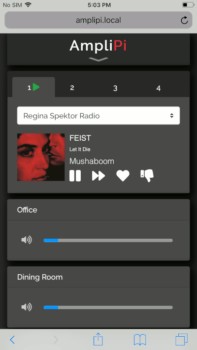

# AmpliPi Home Audio System
[![Build Status][workflow-badge]][workflow-link] [![Coverage][coverage-badge]][coverage-link] [![GPL License][license-badge]](COPYING)

AmpliPi™ is a multi room/zone home audio controller and amplifier made for whole house audio systems with many zones. It can play up to 4 simultaneous audio sources, each of which can be selected from either its analog RCA input or any supported digital stream (Pandora, Spotify, AirPlay, etc). Each source can be routed to one or more zones, all of which are configurable in real-time using the self-hosted AmpliPi Web App or its underlying REST API. It is expandable up to 36 zones using AmpliPi Zone Expanders.

The AmpliPi design is entirely open source, from the software, to the firmware, to the schematics. The REST API and Web App are written in Python and run on a Raspberry Pi 3+ Compute Module. The firmware, which provides the low level volume control and zone configuration, is written in C and configured by the Python API over I2C. All of the internal circuitry comes with full schematics (available in this repo).

The system is self-hosted on the Raspberry Pi and is privacy-centric. By design, AmpliPi doesn’t listen to you or spy on you — it just plays your audio! The way it should be. An internet connection is only needed for some external streaming sources, such as Pandora. The Python application running on the Pi hosts a mobile-friendly website and REST API used to control the system. The website is built on top of the REST API.

Check us out on [Kickstarter](https://www.kickstarter.com/projects/micro-nova/amplipi-home-audio-system)!

## Features

AmpliPi can play many different types of digital streaming inputs. Most of the streaming services supported can be played as independent digital streams on all four sources at once; check out the **Multiple?** heading. Below is the current status of our digital stream integrations.

|Streaming Service|Supported|Multiple?|Metadata|Notes|
|--|--:|--:|--:|--|
|Pandora|Yes|Yes|Yes||
|Airplay|Yes|Yes|Yes|Metadata only available from iTunes|
|Spotify|Yes|Yes|No see [#37](http://github.com/micro-nova/AmpliPi/issues/37)|Requires Spotify Premium, one account per stream|
|DLNA|Yes|Yes|Yes||
|Internet Radio|Yes|Yes|Yes||
|PlexAmp|Yes|No|No||
|Google Cast|No|||Need to investigate|
|Offline Music|No|||See [#66](http://github.com/micro-nova/AmpliPi/issues/66)|
|TIDAL|No|||See [#87](http://github.com/micro-nova/AmpliPi/issues/87)|

In the future we plan to integrate with several home automation systems. Below is their current status.

|Integrations|Supported|Notes|
|--|--:|--|
|Home Assistant|No|Future integration planned|
|openHAB|No|See [#54](http://github.com/micro-nova/AmpliPi/issues/54)|
|Alexa|No|See [#25](http://github.com/micro-nova/AmpliPi/issues/25)|
|Google Assistant|No|See [#69](http://github.com/micro-nova/AmpliPi/issues/69)|

## Quick Start Guide

If you are one of the lucky few to have a pre-release version of the AmpliPi,
see [docs/QUICK_START.md](docs/QUICK_START.md) to get started.

## Speakers

Notes on picking and installing speakers for whole house audio can be found [here](docs/SPEAKERS.md).

## Developing

For details on how to help out with new features and bug fixes, check out [docs/DEVELOPING.md](docs/DEVELOPING.md).

## Web interface
AmpliPi hosts a mobile-friendly web app that can control the system from any PC or mobile phone on the local network. Its design was based on the idea that each of the four audio sources could be controlled separately by different people in the house. Each audio source's controls are in their own tab at the top of the app.

### Selecting an audio source
A source has an input selector to pick what is playing. So, playing a Pandora radio station on that source is as
simple as picking say Matt and Kim Radio from the drop down.

  
  </img>

### Changing Group and Zone volumes
Underneath the input selector are the volume controls for groups and zones connected to the source. The number of zones present is determined by the number of zone expander units discovered during system startup. Zone volume controls only control themselves, whereas group volume controls adjust the volume for all of the zones in the group. The user can create an unlimited number of groups. Zones can also belong to multiple groups.

  
  </img>

### Adding a group or zone to a different source
Below the volumes is an add zone/group selector. To play the current Pandora station when you move to the living room, just add ‘living room’ from the selector. Living room will be removed from the audio source it was previously connected to (if any).

  
  </img>

### Loading a preset
We figured that presets should be simple to access, while not taking up much space while they weren't in use. This compromise led us to hide the presets in the AmpliPi logo. Just click the AmpliPi logo to access the preset control pane. Using presets, we can play the Matt and Kim radio station thoughout the house in a couple of clicks.

  
  </img>

## The REST API
AmpliPi has a REST API that can be used to control volumes, switch and control audio sources, configure different streaming sources, and much more. It allows full configuration and real-time control of the AmpliPi device. The API conforms to the OpenAPI standard. It is fully documented on our [AmpliPi OpenAPI site](https://micro-nova.github.io/AmpliPi).

  
  </img>

With the REST API, you can easily add automation to your home audio system. Use the API to trigger your AmpliPi system to play music based on smart home events. For example, only play music in zones of your house where motion has been detected, or start playing Pandora when the front door is unlocked.

Not quite sure how to accomplish this? No problem - The AmpliPi controller hosts its API documentation as well. Using a web browser pointed at your local AmpliPi box, you can view the API documentation, as well as test sending and receiving API commands to and from the AmpliPi.

[workflow-badge]:  https://github.com/micro-nova/AmpliPi/actions/workflows/python-app.yml/badge.svg
[workflow-link]:   https://github.com/micro-nova/AmpliPi/actions?query=workflow%3Apython-app.yml
[coverage-badge]:  https://codecov.io/github/micro-nova/AmpliPi/coverage.svg?branch=master
[coverage-link]:   https://codecov.io/github/micro-nova/AmpliPi?branch=master
[license-badge]:   https://img.shields.io/badge/License-GPL%20v3-blue.svg
