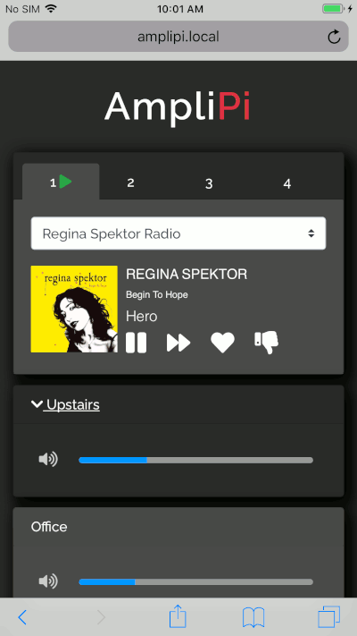
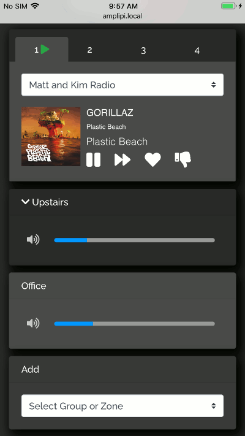
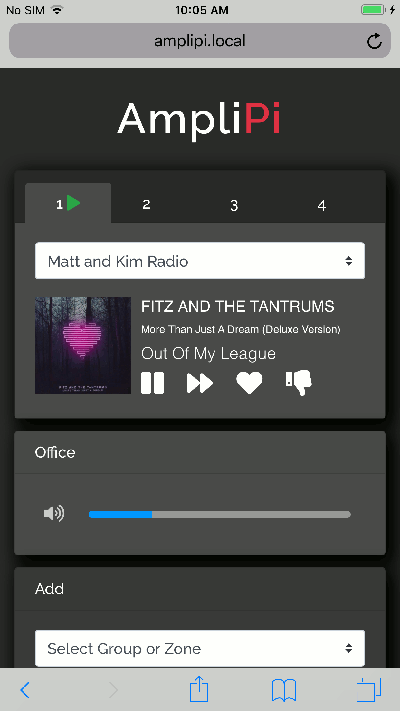
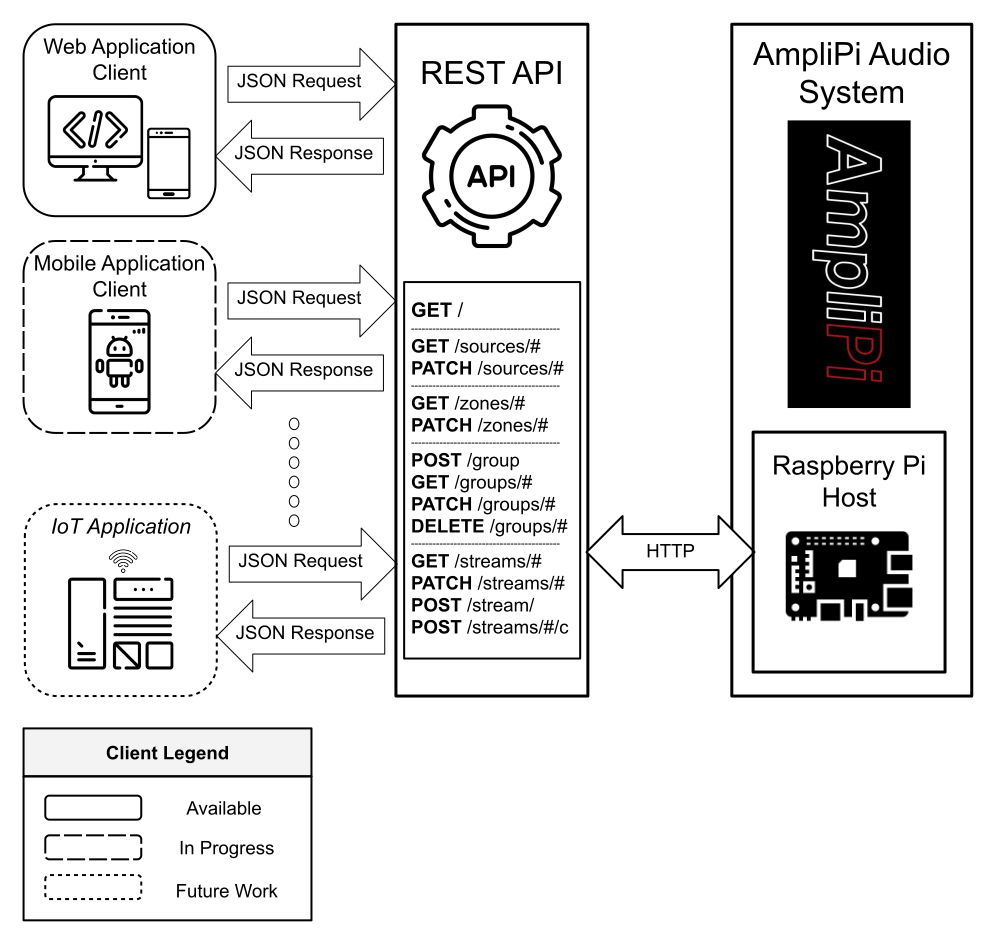

# AmpliPi Home Audio System
[![Build Status][workflow-badge]][workflow-link] [![Coverage][coverage-badge]][coverage-link] [![GPL License][license-badge]](LICENSE.md)

AmpliPi™ is a multi room/zone home audio controller and amplifier made for whole house audio systems with many zones. It can play up to 4 simultaneous audio streams (Pandora, Spotify, AirPlay, etc) or sources (RCA inputs), each routed to one or many zones, all of which are configurable in real-time using the self-hosted AmpliPi Web App or its underlying REST API. It is expandable up to 36 zones using AmpliPi Zone Expanders.

The AmpliPi design is entirely open source, from the software, to the firmware, to the schematics. The REST API and Web App are written in Python and run on a Raspberry Pi 3+ Compute Module. The firmware, which provides the low level volume control and zone configuration, is written in C and configured by the Python API over I2C. All of the internal circuitry comes with full schematics (avaiable in this repo).

The system is self-hosted on the Raspberry Pi and is privacy-centric. By design, AmpiPi doesn’t listen to you or spy on you — it just plays your audio! The way it should be. An internet connection is only needed for some external streaming sources, such as Pandora. The Python application running on the Pi hosts a mobile-friendly website and REST API used to control the system. The website is built on top of the REST API.

Check us out on [Kickstarter](https://www.kickstarter.com/projects/micro-nova/amplipi-home-audio-system)!

## Web interface
AmpliPi hosts a mobile first web app that can control the system from any PC or mobile phone on the local network. It was designed around the idea that each of the 4 audio sources could be controlled individually by separate people in the house. Each of the audio sources’ controls are in their own tab at the top of the app.

### Selecting an audio source
A source has an input selector to pick what is playing. So playing a Pandora radio station on that source is as
simple as picking say Matt and Kim Radio from the drop down.

  
  </img>

### Changing Group and Zone volumes
Underneath the input selector are the volume controls for groups and zones connected to the source. The number of zones present is determined by the number of zone expander units discovered during system startup. Zone volume controls only control themselves, whereas group volume controls adjust the volume for all of the zones in the group. The user can create an unlimited number of groups. Zones can also belong to multiple groups.

  
  </img>

### Adding a group to or zone to a different source
Below the volumes is an add zone/group selector. To play the current Pandora station when you move to the living room, just add ‘living room’ from the selector. Living room will be removed from the audio source it was previously connected to (if any).

  
  </img>

## The REST API
AmpliPi has a REST API that can be used to control volumes, switch and control audio sources, configure different streaming sources, and much more. It allows full configuration and real-time control of the AmpliPi device. The API conforms to the OpenAPI standard. It is fully documented on our [AmpliPi Open API site](https://micro-nova.github.io/AmpliPi).

  
  </img>

With the REST API you can easily add automation to your home audio system. Use the API to trigger your AmpliPi system to play music based on smart home events. For example, only play music in zones of your house where motion has been detected, or start playing Pandora when the front door is unlocked.

Not quite sure how to accomplish this? No problem - The AmpliPi controller hosts it's API documentation as well. Using a web browser pointed at your local AmpliPi box, you can view the API documentation, and also test sending and receiving API commands to and from the AmpliPi.

## Development
See [DEVELOPING.md](DEVELOPING.md) for how to get started working on AmpliPi

[workflow-badge]:  https://github.com/micro-nova/AmpliPi/actions/workflows/python-app.yml/badge.svg
[workflow-link]:   https://github.com/micro-nova/AmpliPi/actions?query=workflow%3Apython-app.yml
[coverage-badge]:  https://codecov.io/github/micro-nova/AmpliPi/coverage.svg?branch=master
[coverage-link]:   https://codecov.io/github/micro-nova/AmpliPi?branch=master
[license-badge]:   https://img.shields.io/badge/License-GPL%20v3-blue.svg
