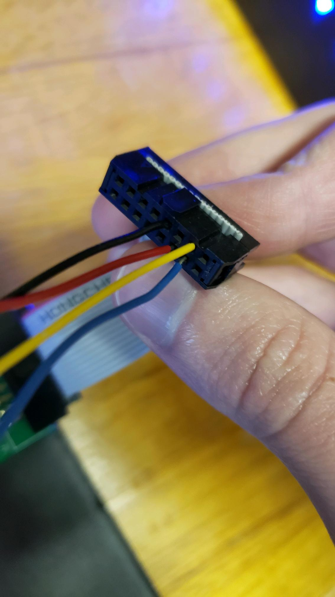
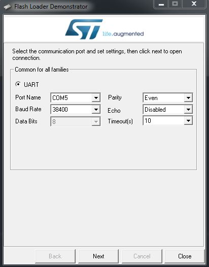
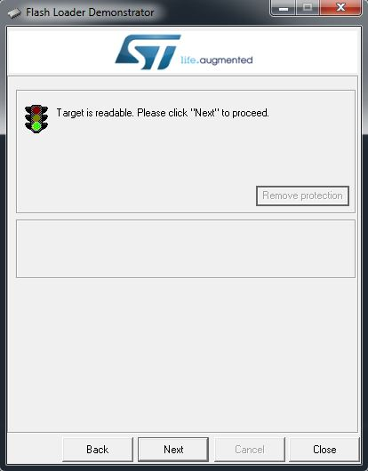
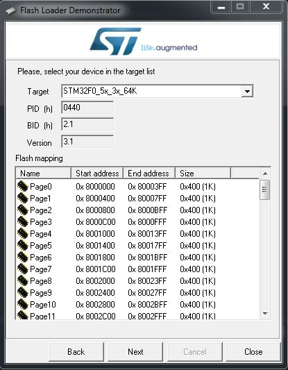
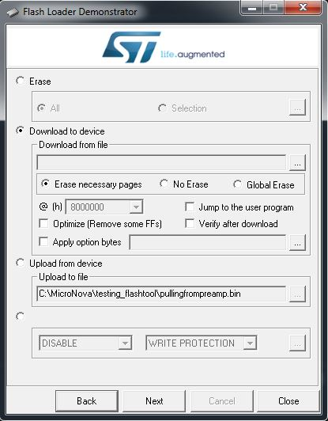
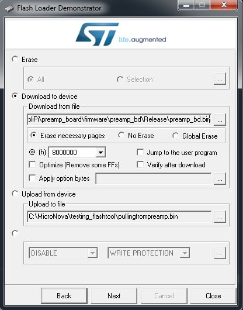
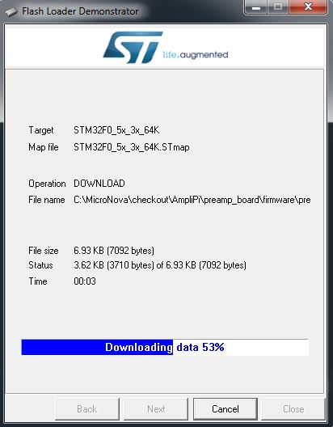
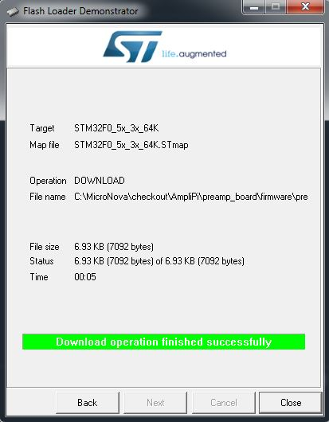

# Flashing AmpliPi Expansion Preamp Boards
This guide will detail the process of flashing expansion board software and the differences from flashing the master
### 1. Physical Setup
First, unplug the power and remove the expansion box from the stack, severing the expansion port connections to/from the box.
Next, set up a USB/UART connection between your PC and the expansion box. A USB chip that splits into Tx, Rx, and GND works best.
Connect the Tx and Rx pins from the PC to pins 13 and 14 respectively on the expansion port ribbon cable. GND can be connected to either pin 9 or 10.
On top of these connections, pin 12 needs to be connected to 3.3V from any source. This will hold the Boot pin high, allowing the device to boot in a flashable state.
Compare your connections to this picture:

    Pin 9 = GND = black wire
    Pin 12 = Boot (3.3V) = red wire
    Pin 13 = Tx = yellow wire
    Pin 14 = Rx = blue wire

### 2. Software Setup
Begin setting up the software side of things by downloading ST's 'Flash Loader Demonstrator' from [here.](https://www.st.com/en/development-tools/flasher-stm32.html)
Once it is installed, run the Demonstrator GUI program. You are presented with a few settings - set them how you prefer, but you can use this picture as a reference:

The port name should be whichever COM port your USB chip is connected to. Once you are satisfied with these settings, plug the box in and hit Next. 
If everything was properly connected, you should see this:

If you do not reach this view, some common errors include:
1. Incorrect Tx/Rx polarity. Switch the wires and try again
2. Waiting too long to hit Next after plugging the box in

From here, we can proceed into some other settings

### 3. Flashing the STM32 Chip
To start, choose a target device. The device pictured below is the STM chip on the preamp board. You can also see a breakdown of the flash mapping in this view.

In this next picture, we can finally see all of the useful features in this application. "Erase" will partially or fully delete the flash. "Download to device" will take a binary file and write it to the STM chip (which is the main purpose of this guide). "Upload from device" will read the flash memory and write it to a binary file whose name you specify. The unlabeled bottom section allows for enabling/disabling the read and write protections on the chip.

To begin the flashing process, select the binary file you would like to download. The official software from MicroNova will be called preamp_bd.bin. Once you have selected a file, its full location should populate the text box, like in the picture below. You can also select how much erasing will occur during flash, which address to start at (8000000 is the beginning), whether to verify the download after it is complete (recommended), and some other niche options. Once these options are sorted out, hit Next, and flashing will begin.

You should see a blue progress bar while operations are taking place, and a green bar once everything is done and verified. Congratulations - you've successfully put new software onto your AmpliPi expansion unit!

