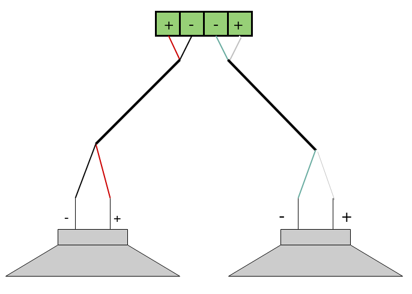
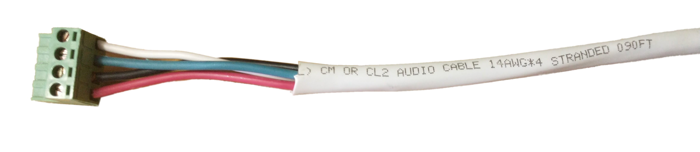

# Installation
## Overview
We understand you will probably be excited to power on your AmpliPro and try it out. To avoid damaging the unit, please read through this guide before installing and powering your AmpliPro unit!

WARNING!! VERIFY THAT THE VOLTAGE OF YOUR WALL OUTLET MATCHES THE VOLTAGE LISTED NEAR THE POWER INLET BEFORE PLUGGING IN.

See the power section for more details on how to change input voltage.

## Mounting and unit placement

Main Controllers and Zone Expanders both ship with built in 19" rackmount ears, so that they can be easily installed into a server rack with mounting screws (not provided).

Some things to keep in mind avoid overheating the unit:
- Don't block the vent holes on the side
- Don't allow dust to build up inside the unit to avoid overheating the unit. See cleaning instructions page for more detail.

## Speakers
Each of AmpliPro's zone outputs can drive a 4-8 Ohm speaker pair, using the provided Phoenix connectors. Here is what the basic wiring diagram for a zone looks like:

AmpliPro's amplifiers are capable of driving 4-8 Ohm speaker loads in a stereo configuration. Here is what a typical stereo speaker connection, using CL2 rated 14-AWG speaker wire and the Pheonix connectors, looks like:

To connect a stereo speaker pair, using speaker wire:

1. Strip 3-4 inches of the cable jacket, then strip 1/4 inch of insulation from the end of each wire.
2. Twist the frayed end of each wire to keep things nice and neat.
3. Unscrew each set screw to open the contacts, then insert and tighten down each wire one by one. Note that set screws loosen, but should not come out.
4. To avoid any shorts, make sure that there aren't any stray wire strands.
5. The speaker set can now be connected to one of the 6 zones.

### Connections
- Improper connection of speakers can damage the unit
- Never connect mutiple speakers in parallel such that it brings the total impedance below 4 ohms (max 2x 8ohm speakers in parallel).
- Amplified speaker ouputs **CAN NOT** be bridged, attempting to do so will damage the amplifier and void the warranty

### Runnning wire in walls and ceilings
- Most electric codes require the use of CL2 rated speaker wire for in-wall installations. Please refer to local building codes for more details.
- Avoid running speaker wire next to AC power wires as much as possble to reduce noise.
- When necessary, cross AC wires at 90 degree angles to avoid introducing any noise into the speakers.

### More Info

Much more information on speaker selection and installation can be the found in AmpliPro’s online documentation and question forums found at the end of this section.

## Preamp Outputs
Each of AmpliPro's zone outputs have a corresponding line-level preout output pair. These outputs can be used to connect powered subwoofers and other active/powered speakers.

The volume output of a preout is controlled by the corresponding speaker output. This allows a connected subwoofer to be controlled propoertionally to the speakers output in the same zone.

## Audio Inputs
Each of the stereo RCA inputs can be connected to a different audio source, such as the output of a TV or a record player.
Expansion Units
To increase the number of zones you can add expansion units to your system. You can add up to 5 additional zone expander units to a single AmpliPro main unit. Each expansion unit adds 6 zones or pairs of speakers. Zones attach to main units using the CHAIN IN/OUT connectors on the rear panel.These are included with each Zone Expander.

## Network connection
Connect an RJ45 cable to the Ethernet port on the main unit. Connect the other end to a port on your main network (likeliy on your router). The unit's IP address is configured by DHCP by default.

## Power
**WARNING!! VERIFY THAT THE VOLTAGE OF YOUR WALL OUTLET MATCHES THE VOLTAGE LISTED NEAR THE POWER INLET.**

AmpliPro ships preconfigured for the typical mains voltage in your region, either 120V mains power or 230V mains; you can see what mode it was set to before shipment based on which box is checked near the power inlet on the unit. If your unit is preconfigured incorrectly for your region, several changes need to be made to the unit to connect to alternative mains:
- Use an appropriate voltage power cable (AmpliPro only ships with the cable rated for the region)
- Change the internal power supply fuse located in the IEC socket (located just above the power inlet on the exterior of the AmpliPro)
- Switch the internal power supply as needed (See below)

Internally, there is a red switch on the side of the power supply that can be toggled for 230V. The easiest way to get at this switch is to take off the top cover. The power supply switch can potentially be accessed through the vent slots on the right side of the unit as well. Here are some pictures to help clarify the process:

Once the unit has the correct input voltage configured, plug the AmpliPro in to a wall outlet. The ON/STANDBY will start of blinking red then transition to solid red once the unit is fully powered on. Continue below to enjoy your unit!

## Startup and Configuration
Now that the AmpliPro unit is powered on, it is time to play with it. Let's see what it can do:

1. Go to amplipi.local (Android and Windows 7 users will need to type the ip address found on the unit's display into their web browser to find the page).
2. You should now be connected to AmpliPro's mobile-friendly website. Please note that an https connection to the AmpliPro is not currently available since certificates have to be managed on a per-unit basis.
3. Android users can download the AmpliPi app in the Google Play Store.
4. Click the plus (+) icon and select a stream
    - The Groove Salad - InternetRadio stream comes preconfigured (needs an internet connection).
5. Change the volume on the zone you would like to output music on. Many of the zones will be hidden inside a group. Click on the different groups to see which zones belong to them.
6. You will probably want to change the default group and zone names and add different streaming sources. The gear icon (⚙) on the bottom right leads to the settings page where you can configure inputs, zones, and groups.

Since AmpliPro is constantly improving, our manual may have been updated. Go to amplipi.com/getting-started or scan the QR code below to view the latest version of our manual.

