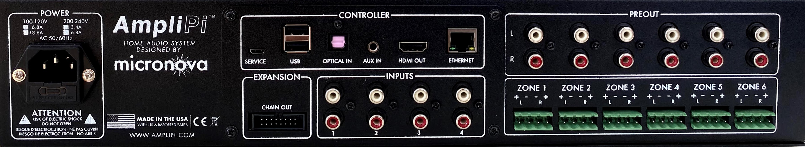

## Safety
- **WARNING!** TO REDUCE THE RISK OF FIRE OR ELECTRIC SHOCK, DO NOT EXPOSE THIS APPLIANCE TO RAIN OR MOISTURE.
- **CAUTION!** TO REDUCE THE RISK OF SHOCK, DO NOT REMOVE THE COVER.

### IMPORTANT SAFETY INSTRUCTIONS
- Read and keep these instructions.
- Heed all warnings and follow all instructions contained within this manual.
- Do not use this unit near water.
- Clean only with dry cloth.
- Do not block any ventilation openings. Install in accordance with the manufacturer’s instructions.
- Do not install near any heat sources such as radiators, heat registers, stoves, or other apparatus (including amplifiers) that produce heat.
- Do not defeat the safety purpose of the polarized or grounding-type plug. A polarized plug has two blades with one wider than the other. A grounding type plug has two blades and a third grounding prong. The wide blade or the third prong are provided for your safety. If the provided plug does not fit into your outlet, consult an electrician for replacement of the obsolete outlet.
- Protect the power cord from being walked on or pinched particularly at plugs, convenience receptacles, and the point where they exit from the unit.
- Only use attachments/accessories specified by the manufacturer.
- Unplug this unit during lightning storms or when unused for long periods of time.
- Refer all servicing to qualified service personnel. Servicing is required when the unit has been damaged in any way, such as when the power-supply cord or plug is damaged, liquid has been spilled, or objects have fallen into the unit, the unit has been exposed to rain or moisture, does not operate normally, or has been dropped.
- Operate the unit only with the voltage specified on the rear. Fire and/or electric shock may result if a higher voltage is used.
- Do not modify, kink, or cut the power cord. Do not place the power cord in close proximity to heaters and do not place heavy objects on the power cord and/or the unit itself, doing so may result in fire or electrical shock.
- Do not touch the speaker terminals as electric shock may result.
- Ensure that the safety ground terminal is connected to a proper ground. Never connect the ground to a gas pipe, as a severe explosion and/or fire may result.
- Be sure the installation of this product is stable, avoid unlevel surfaces as the product may fall and cause injury, property damage, electrocution and/or fire.
- Note that when the unit is turned off, it is not completely disconnected from the AC power outlet. Do not open the cover.
\newpage
## FCC Statement

1. This device complies with Part 15 of the FCC Rules. Operation is subject to the following two conditions:
    - This device may not cause harmful interference.
    - This device must accept any interference received, including interference that may cause undesired operation.
2. FCC Radiation Exposure Statement: Mobile device.
This equipment complies with FCC radiation exposure limits set forth for an uncontrolled environment. In order to avoid the possibility of exceeding the FCC radio frequency exposure limits, human proximity to the antenna shall not be less than 20cm (8 inches) during normal operation.
Changes or modifications not expressly approved by the party responsible for compliance could void the user's authority to operate the equipment.

NOTE: This equipment has been tested and found to comply with the limits for a Class B digital device, pursuant to Part 15 of the FCC Rules. These limits are designed to provide reasonable protection against harmful interference in a residential installation. This equipment generates uses and can radiate radio frequency energy and, if not installed and used in accordance with the instructions, may cause harmful interference to radio communications. However, there is no guarantee that interference will not occur in a particular installation. If this equipment does cause harmful interference to radio or television reception, which can be determined by turning the equipment off and on, the user is encouraged to try to correct the interference by one or more of the following measures:

- Reorient or relocate the receiving antenna.
- Increase the separation between the equipment and receiver.
- Connect the equipment into an outlet on a circuit different from that to which the receiver is connected.
- Consult the dealer or an experienced radio/TV technician for help.

\newpage
# Overview
AmpliPi™ is a multi room/zone home audio controller and amplifier made for whole house audio systems with many zones. It can play up to 4 simultaneous audio streams (Pandora, Spotify, AirPlay, etc) or sources (RCA inputs), each routed to one or many zones, all of which are configurable in real-time using the self-hosted AmpliPi Web App or its underlying REST API. It is expandable up to 36 zones using AmpliPi Expanders.

Your AmpliPi controller includes the following components:

- 1 x AmpliPi Controller
- 1 x This User Manual
- 6 x Phoenix connectors for speaker connections

The following optional accessories are available and can be purchased separately:
- AmpliPi Wall Panel - Wall mountable touch panel that can control volume and playback for a zone or group of zones. Also includes two physical switches for light control.
- AmpliPi Zone Expander - Expansion unit to add more controllable zones. Up to 5 can be added to an AmpliPi controller for a total of 36 zones.

## App

AmpliPi hosts a mobile-friendly web app that can control the system from any PC or mobile phone on the local network. Its design was based on the idea that each of the four audio sources could be controlled separately by different people in the house. Each audio source's controls are in their own tab at the top of the app.

\newpage
## Main Controller
### Front Panel

\setkeys{Gin}{width=.9\linewidth}

- DISPLAY: Show IP Address, Hostname, Password, audio info and zone volumes.
- ON/STANDBY: Show state of the audio controller:
    - Green: Unit is on
    - Red: Unit is in Standby
    - Blinking Red: Unit is waiting to be configured
- ZONE: Show powered state of each zone
    - Blue: Zone is on (not muted)
    - None: Zone is off (muted)

### Rear Panel

\setkeys{Gin}{width=.9\linewidth}

- POWER: 115V, or optionally 230V connection. An internal 115/230 switch is set internally on the power supply and marked on the rear of the unit.
- CONTROLLER: Connections to the embedded Raspberry Pi Controller.
- SERVICE: USB mini connection for re-imaging the Pi's EMMC.
- USB: USB A ports for connecting peripherals such as additional storage devices.
- OPTICAL IN: SPDIF audio input, planned to be used for extra inputs.
- AUX IN: Additional stereo input, planned to be used for announcements.
- HDMI OUT: The Pi's HDMI output, can be used for visualizations or development.
- ETHERNET: Network connection.
- INPUTS: 4 Stereo RCA inputs.
- PREOUT: Unamplified zone audio outputs, intended for powered speakers/subwoofers.
- ZONE X: Amplified stereo outputs for Zone X, using 4-pin Phoenix connectors.
- EXPANSION:
    - CHAIN OUT: Connection to the next expansion unit (if one or more expanders are needed).

\newpage
### Specifications

|Feature||
|:------|:-----|
|Streaming Sources | Airplay, Pandora, Spotify Connect, DLNA  |
|Control Interfaces| Web App, REST API|
|Dimensions        | 2U 19" rackmount unit with 300mm depth|
|Connectivity      | 100Mbps Ethernet|
|                  | HDMI 1.4 output|
|                  | 2x USB 2.0 External|
|                  | 1x USB 2.0 Internal|
|Power Input       | 90-132VAC or 180-264VAC|
|Power Consumption | 6.7W Idle|
|                  | 391W Continuous|
|                  | 782W Peak|
|Peak Current Consumption|6.8A @ 115VAC or 3.4A @230VAC|
|Speaker Power     | 79 WPC @ 4 Ω|
|                  | 57 WPC @ 4 Ω|
|                  | 44 WPC @ 4 Ω|
|Speaker Impedance | 4 -8 Ω |
|Stereo Zones      | 6 |
|Audio Input       | 4 RCA Line In|
|Digital Audio Sources | 32-bit 384KHz (source 1), 16-bit 48KHz (sources 2-4)|
: Specifications

\newpage
## Zone Expander
Adds 6 output zones to an AmpliPi Controller and can be daisy chained to create a massive whole house audio system with up to 36 stereo zone outputs!

### Front Panel
- ON/STANDBY: Show state of the audio controller:
    * Green: Unit is on
    * Red: Unit is in Standby
    * Blinking Red: Unit is waiting to be configured
- ZONE: Show powered state of each zone
    * Blue: Zone is on (not muted)
    * None: Zone is off (muted)

### Rear Panel
- PREOUT: Unamplified zone audio outputs, intended for powered speakers/subwoofers.
- ZONE X: Amplified stereo outputs for Zone X, using 4-pin Phoenix connectors.
- EXPANSION:
    * CHAIN OUT: Connection from previous expansion or main unit.
    * CHAIN OUT: Connection to the next expansion unit (if needed).

### Specifications

|Feature||
|:------|:-----|
|Dimensions        | 2U 19" rackmount unit with 300mm depth|
|Power Input       | 90-132VAC or 180-264VAC|
|Power Consumption | 1W Idle|
|                  | 391W Continuous|
|                  | 782W Peak|
|Peak Current Consumption|6.8A @ 115VAC or 3.4A @230VAC|
|Speaker Power     | 79 WPC @ 4 Ω|
|                  | 57 WPC @ 4 Ω|
|                  | 44 WPC @ 4 Ω|
|Speaker Impedance | 4 -8 Ω |
|Stereo Zones      | 6 |
|Audio Input       | From Controller|
: Specifications

## Wall Panel
See the included Sonoff manual for specifications and installation.

\newpage
# Installation
## Overview
We understand you will probably be excited to power on your AmpliPi and try it out. To avoid damaging the unit, please read through this guide before installing and powering your AmpliPi unit!

WARNING!! DO NOT CONNECT UNIT TO 230V MAINS WITHOUT FIRST SETTING INTERNAL MAINS POWER SWITCH.

## Speakers
Each of AmpliPi's zone outputs can drive a 4-8 Ohm speaker pair, using the provided Phoenix connectors. Here is what the basic wiring diagram for a zone looks like:

AmpliPi's amplifiers are capable of driving 4-8 Ohm speaker loads in a stereo configuration. Here is what a typical stereo speaker connection, using CL2 rated 14-AWG speaker wire and the Phoenix connectors, looks like:

To connect a stereo speaker pair, using speaker wire:

1. Strip 3-4 inches of the cable jacket, then strip 1/4 inch of insulation from the end of each wire.
2. Twist each wire to keep things nice and neat.
3. Unscrew each set screw to open each of the contacts, then insert and tighten down each wire one by one.
4. To avoid any shorts, make sure that there aren't any stray wire strands.
5. The speaker set can now be connected to one of the 6 zones.

Much more information on speaker selection and  installation can be the found in AmpliPi’s online documentation and question forums found at the end of this guide.

## Preamp Outputs
## Audio Inputs
Each of the stereo RCA inputs can be connected to a different audio source, such as the output of a TV or a record player.
Expansion Units
To increase the number of zones you can add expansion units to your system. You can add up to 5 additional zone expander units to a single AmpliPi main unit. Each expansion unit adds 6 zones or pairs of speakers. Zones attach to main units using the CHAIN IN/OUT connectors on the rear panel.These are included with each Zone Expander.

## Network connection
Connect an RJ45 cable to the Ethernet port on the main unit.

## Power
Just a friendly reminder, to avoid causing hardware damage:

**WARNING!! DO NOT CONNECT UNIT TO 230V MAINS WITHOUT FIRST SETTING INTERNAL MAINS POWER SWITCH.**

AmpliPi ships preconfigured for 120V mains power, but can be switched over to work on 230V mains. Internally, there is a red switch on the side of the Meanwell power supply that can be toggled for 230V. The easiest way to get at this witch is to take off the top cover. The power supply switch can potentially be accessed through the vent slots on the right side of the unit as well. Here are some pictures to help clarify the process:

Once the unit has the correct input voltage configured, plug in the AmpliPi to a wall outlet. The ON/STANDBY will start of blinking red then transition to red once the unit is fully powered on. Continue below to enjoy your unit!

## Startup and Configuration
Now that the AmpliPi unit is powered on, it is time to play with it. Let's see what it can do:

1. Go to amplipi.local (Android and Windows 7 users will need to type the ip address found on the unit's display into their web browser to find the page).
2. You should now be connected to AmpliPi's mobile-friendly website. Please note that an https connection to the AmpliPi is not currently available since certificates have to be managed on a per-unit basis.
3. Android users can download the AmpliPi app in the Google Play Store.
4. Pick an audio input using the selector
    - The Groove Salad - internetradio stream comes preconfigured (needs an internet connection).
5. Change the volume on the zone you would like to output music on. Many of the zones will be hidden inside a group. Click on the different groups to see which zones belong to them.
6. You will probably want to change the default group and zone names and add different streaming sources. The Gear icon () provides an interface to configure inputs, zones, and groups.

We know you will want to setup and configure more of your AmpliPi! Since this was printed we added more features and made the AmpliPi better! This guide is continued at amplipi.com/getting-started. Use the QR code below to jump there now.
