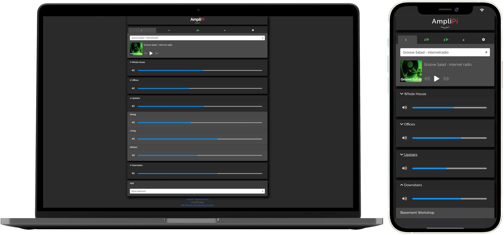

# Overview
AmpliPi™ is a multi room/zone home audio controller and amplifier made for whole house audio systems with many zones. It can play up to 4 simultaneous audio streams (Pandora, Spotify, AirPlay, etc) or sources (RCA inputs), each routed to one or many zones, all of which are configurable in real-time using the self-hosted AmpliPi Web App or its underlying REST API. It is expandable up to 36 zones using AmpliPi Expanders.

Your AmpliPi controller includes the following components:

- 1 x AmpliPi Controller
- 1 x This User Manual
- 6 x Phoenix connectors for speaker connections

The following optional accessories are available and can be purchased separately:

- **AmpliPi Wall Panel**: Wall mountable touch panel that can control volume and playback for a zone or group of zones. Also includes two physical switches for light control, intended to replace the light switch in the room it's installed in.
- **AmpliPi Zone Expander**: Expansion unit to add more controllable zones. Up to 5 can be added to an AmpliPi controller for a total of 36 zones.

## App

AmpliPi hosts a mobile-friendly web app that can control the system from any PC or mobile phone on the local network. Its design was based on the idea that each of the four audio sources could be controlled separately by different people in the house. Each audio source's controls are in their own tab at the top of the app.
