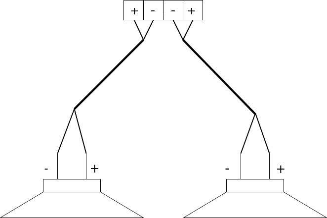

# Quick Start Guide

Thanks for supporting AmpliPi, we hope you love your new unit!

## Installation

We suggest making the speaker connections before connecting AmpliPi to power.

### Back Panel

### Speakers

Each of AmpliPi's 6 zones can drive a 4-8 Ohm speaker pair, using the provided Pheonix connectors. Here is what the basic wiring diagram for a zone looks like:

AmpliPi's amplifiers are capable of driving 4-8 Ohm speaker loads, in a stereo configuration. Here is what a typical speaker connection, using CL2 rated 14-AWG speaker wire and the Pheonix connectors, looks like:

To connect the speaker wire, strip 3-4 inches of the cable jacket, and then strip 1/4 inch of insulation from the end of each wire. Twist each wire to keep things nice and neat. Unscrew each set screw to open each of the contacts and then insert and tighten down each wire one by one. To avoid any shorts, make sure that there aren't any stray strands.

### Networking

Connect the AmpliPi to your local network using a CAT5 or better cable. The AmpliPi controller expects to be connected to a DHCP capable network. Once AmpliPi has booted, its display will show the network connection status, including its ip-address.

### Power

Plug the unit into an 115v outlet using the supplied power cable. Customers with a 230v connection will need to supply their own cable. Once plugged in the AmpliPi will start booting, the display will not be driven until the Pi has fully booted and the AmpliPi server has started, this takes about 20 seconds.

## Try it out!

Now that the AmpliPi unit is powered on, its time to play with it. Let's see what it can do:

1. Go to [amplipi.local](http://amplipi.local) (Android and Windows 7 users will need to specify the ip address found on the unit's display). You should now be connected to AmpliPi's mobile friendly website.
1. Pick a source, using the selector. The `internet radio` comes preconfigured with a radio station (needs an internet connection).
1. Change the volume on the zone you would like to output music on

## Configuration
You will probably want to change the default group and zone names and add different streaming sources. We are planning on having a simple interface for configuring all of this, for now we use the interactive [API](http://amplipi.local/doc) to change these configurations.

Try it out at [amplipi.local/api/doc](http://amplipi.local/doc). This is available via the API link at the bottom of the main page.
