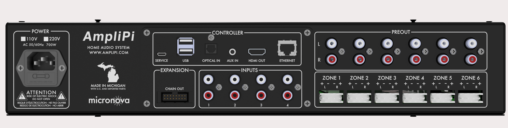
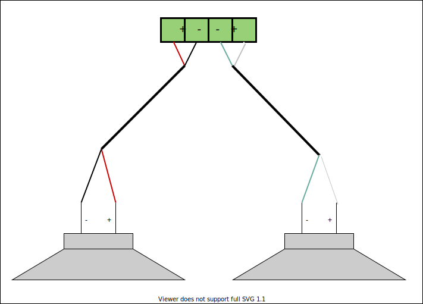
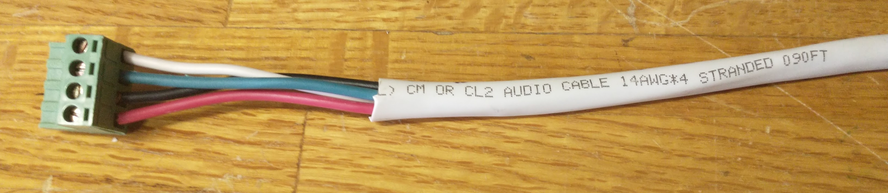

# Quick Start Guide

Thanks for supporting AmpliPi, we hope you love your new unit!

## Installation

We suggest making the speaker connections before connecting AmpliPi to power. Please check out the steps below for more information on how to install your AmpliPi unit.

### Back Panel

All of the connections will be made to the back panel. Here's a quick reference for each of the different connections:
- **POWER**: 110v or 220v connection, 120/220 switch is set on internal power supply and marked, see [Power](#power)
- **CONTROLLER**: Connections to the embedded Raspberry Pi Controller
  - **SERVICE**: USB mini connection for reimaging the Pi's EMMC
  - **USB**:  USB A ports for connecting peripherals such as additional storage devices
  - **OPTICAL IN**: SPDIF audio input, planned to be used for extra inputs
  - **AUX IN**: Additional stereo input, planned to be used for announcements
  - **HDMI OUT**: The Pi's HMDI output, can be used for visualizations or development
  - **ETHERNET**: Network connection, see [Networking](#networking)
- **INPUTS**: 4 Stereo RCA inputs, see [RCA Inputs](#rca-inputs)
- **PREOUT**: Unamplified zone audio outputs, intended for powered speakers/subwoofers
- **ZONE X**: Amplified stereo outputs for Zone X, using 4-pin Phoenix connectors see [Speakers](#speakers)
- **EXPANSION**: Connection to additional expansion unit (multiple units can be daisy-chained)

### Speakers

Each of AmpliPi's 6 zones can drive a 4-8 Ohm speaker pair, using the provided Phoenix connectors. Here is what the basic wiring diagram for a zone looks like:

AmpliPi's amplifiers are capable of driving 4-8 Ohm speaker loads in a stereo configuration. Here is what a typical stereo speaker connection, using CL2 rated 14-AWG speaker wire and the Phoenix connectors, looks like:

To connect a stereo speaker pair, using speaker wire:
1. Strip 3-4 inches of the cable jacket, then strip 1/4 inch of insulation from the end of each wire.
1. Twist each wire to keep things nice and neat.
1. Unscrew each set screw to open each of the contacts, then insert and tighten down each wire one by one.
1. To avoid any shorts, make sure that there aren't any stray wire strands.
1. The speaker set can now be connected to one of the 6 zones.

### RCA inputs

Each of the stereo RCA inputs can be connected to a different audio source, such as the output of a TV or a record player.

### Power

Plug the unit into an 110v/220v outlet using the supplied power cable. Based on your location, we have attempted to configure the AmpliPi into the correct power mode and supply the appropriate cable. Please contact amplipi@micro-nova.com if we have made a mistake.

Once plugged in, the AmpliPi will start booting. The display will not be driven until the Pi has fully booted and the AmpliPi server has started; this takes about 20 seconds.

### Networking

Connect the AmpliPi to your local network using a CAT5 or better cable. The AmpliPi controller expects to be connected to a DHCP capable network. Once AmpliPi has booted, its display will show the network connection status, including its ip-address.

## Try it out!

Now that the AmpliPi unit is powered on, it is time to play with it. Let's see what it can do:

1. Go to [amplipi.local](http://amplipi.local/0) (Android and Windows 7 users will need to type the ip address found on the unit's display into their web browser to find the page). You should now be connected to AmpliPi's mobile-friendly website. Please note that an https connection to the AmpliPi is not currently available since certificates have to be managed on a per-unit basis.
1. Pick a source using the selector. The `Groove Salad - internetradio` stream comes preconfigured (needs an internet connection).
1. Change the volume on the zone you would like to output music on. Many of the zones will be hidden inside a group. Click on the different groups to see which zones belong to them.

## Configuration

You will probably want to change the default group and zone names and add different streaming sources. We are planning on having a simple interface for configuring all of this. For now, we use the interactive [API](http://amplipi.local/doc) to change these configurations. Follow the "Try it out" guide at the top of the API page to walk through some initial changes.

The API is also available via the API link at the bottom of the [main page](http://amplipi.local/0).

## Feedback

We would love to hear your feedback about AmpliPi.

- Feature requests and bug reports please [Create an issue](https://github.com/micro-nova/AmpliPi/issues/new).
- Feedback on webapp: [Add comments to Webapp Feedback](https://github.com/micro-nova/AmpliPi/issues/34)
- Other feedback: [Add or Comment on a discussion](https://github.com/micro-nova/AmpliPi/discussions)
