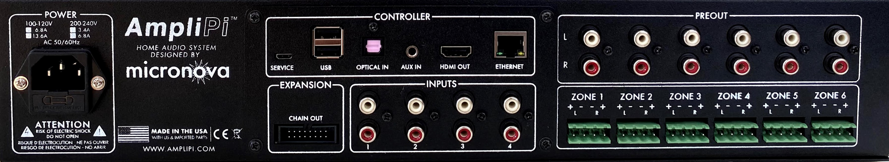

# Quick Start Guide

Thanks for supporting AmpliPi, we hope you love your new unit!

## Installation

We suggest making the speaker connections before connecting AmpliPi to power. Please check out the steps below for more information on how to install your AmpliPi unit.

WARNING!! DO NOT CONNECT UNIT TO 230V MAINS WITHOUT FIRST SETTING INTERNAL MAINS POWER SWITCH see [Power](#power).

### Back Panel

All of the connections will be made to the back panel. Here's a quick reference for each of the different connections:
- **POWER**: 115V, or optionally 230V connection, 115/230 switch is set on internal power supply and marked on rear of unit, see [Power](#power)
- **CONTROLLER**: Connections to the embedded Raspberry Pi Controller
  - **SERVICE**: USB mini connection for re-imaging the Pi's EMMC
  - **USB**:  USB A ports for connecting peripherals such as additional storage devices
  - **OPTICAL IN**: SPDIF audio input, planned to be used for extra inputs
  - **AUX IN**: Additional stereo input, planned to be used for announcements
  - **HDMI OUT**: The Pi's HMDI output, can be used for visualizations or development
  - **ETHERNET**: Network connection, see [Networking](#networking)
- **INPUTS**: 4 Stereo RCA inputs, see [RCA Inputs](#rca-inputs)
- **PREOUT**: Unamplified zone audio outputs, intended for powered speakers/subwoofers
- **ZONE X**: Amplified stereo outputs for Zone X, using 4-pin Phoenix connectors see [Speakers](#speakers)
- **EXPANSION**: Connection to additional expansion unit (multiple units can be daisy-chained), see [Expansion Units](#expansion)

### Speakers

Each of AmpliPi's 6 zones can drive a 4-8 Ohm speaker pair, using the provided Phoenix connectors. Here is what the basic wiring diagram for a zone looks like:

AmpliPi's amplifiers are capable of driving 4-8 Ohm speaker loads in a stereo configuration. Here is what a typical stereo speaker connection, using CL2 rated 14-AWG speaker wire and the Phoenix connectors, looks like:

To connect a stereo speaker pair, using speaker wire:
1. Strip 3-4 inches of the cable jacket, then strip 1/4 inch of insulation from the end of each wire.
1. Twist each wire to keep things nice and neat.
1. Unscrew each set screw to open each of the contacts, then insert and tighten down each wire one by one.
1. To avoid any shorts, make sure that there aren't any stray wire strands.
1. The speaker set can now be connected to one of the 6 zones.

Check out the [Tested / Recommended Speakers and Wires ](https://amplipi.discourse.group/t/tested-recommended-speakers-and-speaker-wire/31)
to learn about some of the various speakers the MicroNova crew and other users have tested with AmpliPi.

### RCA inputs

Each of the stereo RCA inputs can be connected to a different audio source, such as the output of a TV or a record player.

### Power

Plug the unit into an 120V outlet using the supplied power cable.
WARNING: if you intend to power AmpliPi with 230V mains, you must set the input
voltage selector switch to 230V line voltage BEFORE supplying power to the unit.
Failure to do this will damage the unit.
The input voltage selector switch is located on the right side of the MeanWell PSU inside the AmpliPi.
It can be accessed either through the vent slots on the side of the unit or by removing the top cover.
For more details and pictures of the process, check out the [guide](https://amplipi.discourse.group/t/setting-your-amplipi-for-230v-operation/69).
Please contact amplipi@micro-nova.com before powering up the unit if you have any questions.

Once plugged in, the AmpliPi will start booting. The display will not be driven until the Pi has fully booted and the AmpliPi server has started; this takes about 20 seconds. By default the display will sleep after 60 seconds but can be woken up by a touch.

### Networking

Connect the AmpliPi to your local network using a CAT5 or better cable. The AmpliPi controller expects to be connected to a DHCP capable network. Once AmpliPi has booted, its display will show the network connection status, including its ip-address.

### Expansion

An AmpliPi main unit can service up to 6 zones or pairs of speakers.
To increase the number of zones you can add expansion units to your system.
You can add up to 5 additional zone expander units to a single AmpliPi main unit.
Each expansion unit adds 6 zones or pairs of speakers.
Zones attach to main units using the CHAIN IN/OUT connectors on the rear panel.

## Try it out!

Now that the AmpliPi unit is powered on, it is time to play with it. Let's see what it can do:

1. Go to [amplipi.local](http://amplipi.local/0) (Android and Windows 7 users will need to type the ip address found on the unit's display into their web browser to find the page).
   You should now be connected to AmpliPi's mobile-friendly website.
   Please note that an https connection to the AmpliPi is not currently available since certificates have to be managed on a per-unit basis.
   Android users can download the [AmpliPi app](https://play.google.com/store/apps/details?id=com.amplipishellapp) in the Google Play Store.
1. Pick an audio input using the selector. The `Groove Salad - internetradio` stream comes preconfigured (needs an internet connection).
1. Change the volume on the zone you would like to output music on. Many of the zones will be hidden inside a group. Click on the different groups to see which zones belong to them.

Check out the web app demos here: [docs/WEB_APP.md](WEB_APP.md) for more information.

## Configuration

You will probably want to change the default group and zone names and add different streaming sources. The Gear icon (⚙) provides an interface to configure inputs, zones, and groups. Additional configuration will be added in the future. See [docs/WEB_APP.md](WEB_APP.md#settings) for some configuration examples.

Advanced configuration, such as presets, will need to use the API, check out the built in interactive [API docs](http://amplipi.local/doc). Follow the "Try it out" guide at the top of the API page to walk through some initial changes.

The API is also available via the API link at the bottom of the [main page](http://amplipi.local/0).

## Feedback and User Community

- The AmpliPi [user community](https://amplipi.discourse.group/) is a great place to learn more about AmpliPi, post questions, and interact with other AmpliPi users!
- Feature requests and bug reports please [Create an issue](https://github.com/micro-nova/AmpliPi/issues/new).
- Feedback on webapp: [Add comments to Webapp Feedback](https://github.com/micro-nova/AmpliPi/issues/34)
- Other feedback: [Add or Comment on a discussion](https://github.com/micro-nova/AmpliPi/discussions)

