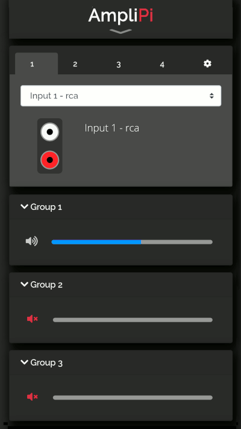
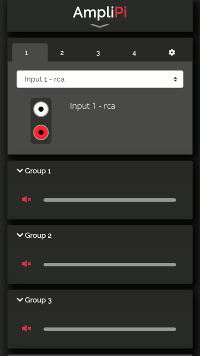

# Web interface
AmpliPi hosts a mobile-friendly web app that can control the system from any PC or mobile phone on the local network. Its design was based on the idea that each of the four audio sources could be controlled separately by different people in the house. Each audio source's controls are in their own tab at the top of the app.

## Selecting an audio source
A source has an input selector to pick what is playing. So, playing a Pandora radio station on that source is as
simple as picking say Matt and Kim Radio from the drop down.

  
  </img>

## Changing Group and Zone volumes
Underneath the input selector are the volume controls for groups and zones connected to the source. The number of zones present is determined by the number of zone expander units discovered during system startup. Zone volume controls only control themselves, whereas group volume controls adjust the volume for all of the zones in the group. The user can create an unlimited number of groups. Zones can also belong to multiple groups.

  
  </img>

## Adding a group or zone to a different source
Below the volumes is an add zone/group selector. To play the current Pandora station when you move to the living room, just add ‘living room’ from the selector. Living room will be removed from the audio source it was previously connected to (if any).

  
  </img>

## Loading a preset
We figured that presets should be simple to access, while not taking up much space while they weren't in use. This compromise led us to hide the presets in the AmpliPi logo. Just click the AmpliPi logo to access the preset control pane. Using presets, we can play the Matt and Kim radio station thoughout the house in a couple of clicks.

  
  </img>

## Settings
The setting menu, found with the gear icon (⚙) in the top right corner provides an interface to configure inputs, zones, and groups.

### Configuring an RCA Input
Each of the 4 RCA Inputs can be named based on the device connected using the ⚙->Inputs menu. Below is an example of how to rename Input 1.

  
  </img>

### Configuring a Pandora Stream
Changing the configuration of different streams or creating new streams can be done using the ⚙->Inputs menu. Below is an example of how to configure the default pandora station to play Matt and Kim radio.

  
  </img>

