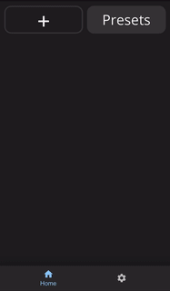

# Web interface
AmpliPi hosts a mobile-friendly web app that can control the system from any PC or mobile phone on the local network. Its design was based on the idea that each of the four audio sources could be controlled separately by different people in the house. Each audio source's controls are in their own tab at the top of the app.

## Selecting an audio source
A source has an input selector to pick what is playing. So, playing a Pandora radio station on that source is as
simple as picking say Matt and Kim Radio from the pop up
You can do this by tapping the name of the source on either the home view or the player view

  
  </img>

## Changing Group and Zone volumes
There are volume controls at the bottom of every mini-player on the home screen that will effect all groups and zones that source is playing to. To change the volume of groups or zones individually, select the player by tapping the center of the mini-player on the home screen and then enter the player view tab at the bottom of the screen, then open the dropdowns to find the volume slider you want.
The number of zones present is determined by the number of zone expander units discovered during system startup. Zone volume controls only control themselves, whereas group volume controls adjust the volume for all of the zones in the group. The user can create an unlimited number of groups. Zones can also belong to multiple groups.

  
  </img>

## Adding a group or zone to a different source
Below the volumes is an add zone/group selector. To play the current Pandora station when you move to the living room, just add ‘living room’ from the selector. Living room will be removed from the audio source it was previously connected to (if any).

  
  </img>

## Loading a preset
Presets allow you to return your system to a specific state, with different sources playing in specific zones at the specific volumes. To create a preset, go to the settings page (the gear icon ⚙ on the bottom tab) and enter the presets page to create a preset based on your current system state, creating a save file of what sources are playing in what groups/zones at the volumes they're currently set to.
To use a preset, hit the presets button on the main page and select whichever preset you'd like.

  
  </img>

## Settings
The setting menu, found with the gear icon (⚙) in the bottom right corner provides an interface to configure inputs, zones, and groups.

### Configuring an RCA Input
Each of the 4 RCA Inputs can be named based on the device connected using the ⚙->Streams menu. Below is an example of how to rename Input 1.

  
  </img>

### Configuring a Pandora Stream
Changing the configuration of different streams or creating new streams can be done using the ⚙->Streams menu. Below is an example of how to configure the default pandora station, as well as an example of a station ID and where to find it.

  
  </img>

  
  </img>

