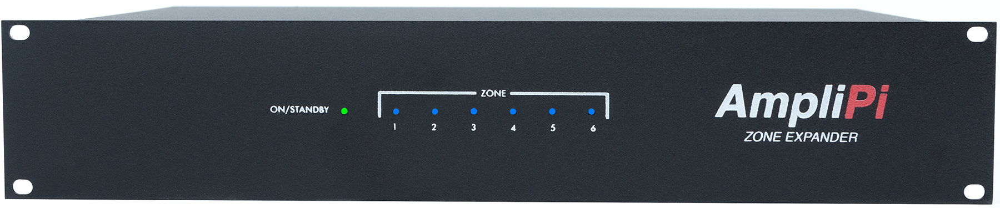
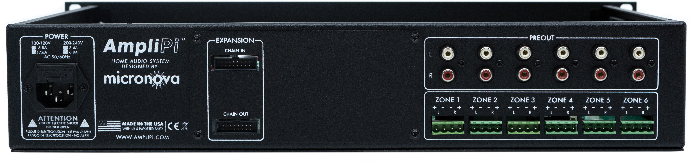

## Zone Expander
Adds 6 output zones to an AmpliPro Controller (often referred to as "AmpliPro Main Unit") and can be daisy chained to create a massive whole house audio system with up to 36 stereo zone outputs!

### Front Panel

- **ON/STANDBY**: Show state of the audio controller:
    * Green: Unit is on
    * Red: Unit is in Standby
    * Blinking Red: Unit is waiting to be configured
- **ZONE**: Show powered state of each zone
    * Blue: Zone is on (not muted)
    * None: Zone is off (muted)

### Rear Panel

- **PREOUT**: Unamplified zone audio outputs, intended for powered speakers/subwoofers.
- **ZONE X**: Amplified stereo outputs for Zone X, using 4-pin Phoenix connectors.
- **EXPANSION**:
    * **CHAIN OUT**: Connection from previous expansion or main unit.
    * **CHAIN OUT**: Connection to the next expansion unit (if needed).
