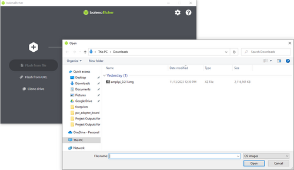

# Imaging with Etcher

## What You'll Need
  * A computer running Windows, MacOS or Linux
  * A micro USB cable
  * Your AmpliPi

## 1. Get the Latest AmpliPi Image
  Download the latest AmpliPi image from [here](https://storage.googleapis.com/amplipi-img/amplipi_0.3.1.img.xz) ([md5sum](https://storage.googleapis.com/amplipi-img/CHECKSUMS), [.sig](https://storage.googleapis.com/amplipi-img/CHECKSUMS.sig)) and save it to your computer.

## 2. Get RPIBoot
Download and install the latest version of RPIBoot from [here](https://github.com/raspberrypi/usbboot/raw/master/win32/rpiboot_setup.exe) on windows, otherwise refer to the instructions for [building RPIBoot](https://github.com/raspberrypi/usbboot#building).

## 3. Get Etcher
Download and install (if necessary) the latest version of Etcher from [etcher.io](https://etcher.io/), on windows use the portable version.

## 4. Connect your AmpliPi to your computer
  Unplug your AmpliPi from power and then connect your AmpliPi to your computer via the service port using the micro USB cable. Once connected, plug your AmpliPi back into power.

  

  IMPORTANT - You must connect your AmpliPi to your computer before plugging it into power or the Compute Module will not be recognized.

## 5. Open Etcher and Select the AmpliPi Image
  Open Etcher and select "Flash from file", then select the AmpliPi image you downloaded in step 1.

 

## 6. Select the Compute Module
  Click the "Select target" button and select the Compute Module from the list of available drives.

  

  WARNING -  Make sure to select the compute module! If you select the wrong drive, you may overwrite your computer's hard drive!

## 7. Flash the Image
  Click the "Flash!" button to begin flashing the image to your AmpliPi.

  

  This process may take several minutes so feel free to grab a cup of coffee or your preferred beverage.

## 8. Disconnect your AmpliPi from your computer
  Once Etcher has finished flashing the image, unplug your AmpliPi from power and disconnect the micro USB cable. Now you're ready to boot up your AmpliPi! The username and password will be reset to the defaults of pi and raspberry, respectively.

  

  IMPORTANT - You must unplug your micro USB cable before plugging your AmpliPi back into power or the Compute Module will not boot properly.
