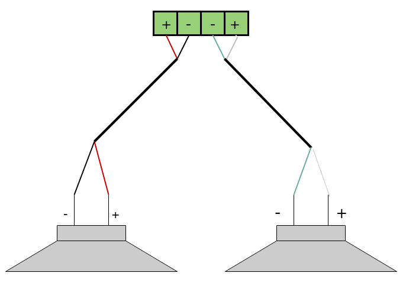
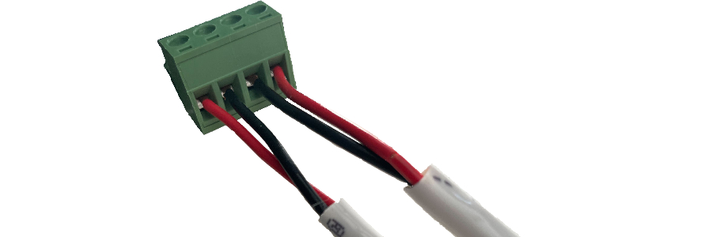

# Installation
## Overview
We understand you will probably be excited to power on your AmpliPro and try it out. To avoid damaging the unit, please read through this guide before installing and powering your AmpliPro unit!

WARNING!! VERIFY THAT THE VOLTAGE OF YOUR WALL OUTLET MATCHES THE VOLTAGE LISTED NEAR THE POWER INLET BEFORE PLUGGING IN. IF THE VOLTAGE IS NOT MATCHED, PLEASE CONTACT US AT support@micro-nova.com

## Mounting and unit placement

Main Controllers and Zone Expanders both ship with built-in 19" rackmount ears, so that they can be easily installed into a server rack with mounting screws (not provided).
Both the main and expansion units are approximately 15 pounds (6.8 kilograms)

Some things to keep in mind to avoid overheating the unit:
- Don't block the vent holes on the side
- Don't allow dust to build up inside the unit. See cleaning instructions on the safety page for more details.

## Speakers
Each of AmpliPro's zones has two speaker outputs that drive a 4-8 Ohm speaker, using the provided Euroblock connectors. Here is what the basic wiring diagram for a zone looks like:

AmpliPro's amplifiers are capable of driving 4-8 Ohm speaker loads and only support stereo configuration. Here is what a typical stereo speaker connection, using CL2-rated 14-AWG speaker wire and the Euroblock connectors, looks like:

To connect a stereo speaker pair using speaker wire:

1. Strip 3-4 inches of the cable jacket, then strip 1/4 inch of insulation from the end of each wire.
2. Twist the frayed end of each wire to keep things nice and neat.
3. Please note that the wiring diagram (the image with four green squares wired to two speakers) shows polarity, not necessarily the colors of the wires. Make sure you connect positive to positive and negative to negative while also keeping the left and right channels separated into their own speakers.
4. Unscrew each set screw to open the contacts, then insert and tighten down each wire one by one. Note that set screws loosen, but should not come out.
5. To avoid any shorts, make sure that there aren't any stray wire strands.
6. The speaker set can now be connected to one of the 6 zones.

### Connections
- Improper connection of speakers can damage the unit
- Never connect multiple speakers in parallel such that it brings the total impedance below 4 ohms (max 2x 8ohm speakers in parallel).
- Amplified speaker outputs **CAN NOT** be bridged, attempting to do so will damage the amplifier and void the warranty

### Running wire in walls and ceilings
- Most electric codes require the use of CL2-rated speaker wires for in-wall installations. Please refer to local building codes for more details.
- Avoid running speaker wires next to AC power wires as much as possible to reduce noise.
- When necessary, cross AC wires at 90-degree angles to avoid introducing any noise into the speakers.

### More Info

Much more information on speaker selection and installation can be found in AmpliPro’s online documentation and question forums found at the end of this section.

## Preamp Outputs
Each of AmpliPro's zone outputs has a corresponding line-level preout-output pair. These outputs can be used to connect powered subwoofers and other active/powered speakers.

The volume output of a preout is controlled by the corresponding speaker output. This allows a connected subwoofer to be controlled proportionally to the speaker's output in the same zone.

## Audio Inputs
Each of the stereo RCA inputs can be connected to a different audio source, such as the output of a TV or other compatible device.

## Expansion Units
To increase the number of zones you can add expansion units to your system. You can add up to 5 additional zone expander units to a single AmpliPro main unit. Each expansion unit adds 6 zones or pairs of speakers. Zones attach to main units using the CHAIN IN/OUT connectors on the rear panel. These are included with each Zone Expander.

## Network connection
Connect an RJ45 cable to the Ethernet port on the main unit. Connect the other end to a port on your main network (likely on your router). The unit's IP address is configured by DHCP.

## Power
**WARNING!! VERIFY THAT THE VOLTAGE OF YOUR WALL OUTLET MATCHES THE VOLTAGE LISTED NEAR THE POWER INLET.**

AmpliPro ships preconfigured for the typical mains voltage in your region, either 120V mains power or 230V mains; you can see what mode it was set to before shipment based on what hole near the power inlet has a plastic peg/screw in it. If your unit is preconfigured incorrectly for your region, please contact us at support@micro-nova.com

Once you've ensured that the unit has the correct input voltage configured, plug the AmpliPro into a wall outlet. The ON/STANDBY will start off blinking red and then transition to solid red once the unit is fully powered on. Continue below to enjoy your unit!

## Startup and Configuration
Now that the AmpliPro unit is powered on, it is time to play with it. To access the UI, there are two options:

### Webapp

1. Go to amplipi.local (Android and Windows 7 users will need to type the IP address found on the unit's display into their web browser to find the page).
2. You should now be connected to AmpliPro's mobile-friendly website. Please note that an HTTPS connection to the AmpliPro is not currently available since certificates have to be managed on a per-unit basis.

### Mobile App

1. We have mobile apps for Android and iOS, simply search for "Amplipi" on the Google Play Store or Apple's App Store
2. Once you have the app downloaded, permit the app to access devices on your local network. The app will automatically search your network for active AmpliPro units.
3. On the off chance you have multiple controllers, it will ask which unit you wish to connect to. We suggest giving different hostnames to each unit if you have multiple controllers on the same network for this reason.

After taking either the Webapp or Mobile app route, your next steps will be the same:

1. Click the plus (+) icon and select a stream
    - The Groove Salad - InternetRadio stream comes preconfigured (needs an internet connection).
2. Change the volume on the zone you would like to output music on. Many of the zones will be hidden inside a group. Click on the different groups to see which zones belong to them.
3. You will probably want to change the default group and zone names and add different streaming sources. The gear icon on the bottom right leads to the settings page where you can configure inputs, zones, and groups.

Since receiving your unit, this manual may have changed. Go to amplipi.com/getting-started or scan the QR code below to view the latest version of our manual.

