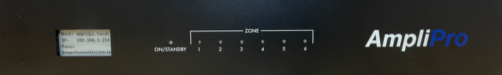
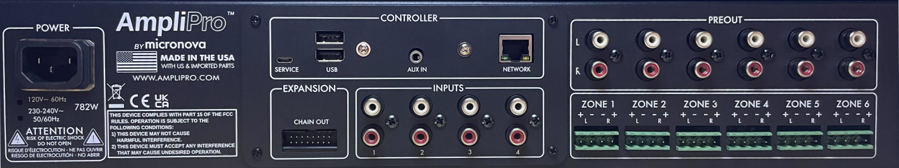

## Main Controller
### Front Panel

1. **DISPLAY**: Displays IP Address, Hostname, and SSH Password.
2. **ON/STANDBY**: Displays the state of the audio controller:
    - Green: The unit is on
    - Red: The unit is on Standby
    - Blinking Red: The unit is updating / booting
3. **ZONE**: Displays the power state of each zone
    - Blue: Zone is on (not muted)
    - None: Zone is off (muted)

### Rear Panel

- **POWER**: 115V, or optionally 230V connection. See the installation page for more details.
- **CONTROLLER**:
    - **SERVICE**: USB mini connection for re-imaging the AmpliPro device.
    - **USB**: USB A ports for connecting peripherals such as additional storage devices. Do not power a device plugged into the RCA inputs using the USBs, see the installation page for more details.
    - **AUX IN**: Additional stereo input.
    - **ETHERNET**: Network connection.
- **INPUTS**: 4 Stereo auxilliary RCA inputs.
- **PREOUT**: Unamplified zone audio outputs, intended for use with powered speakers/subwoofers.
- **ZONE X**: Amplified stereo outputs for Zone X, using 4-pin euroblock connectors.
- **EXPANSION**: Connection to the next expansion unit (if one or more expanders are needed).
