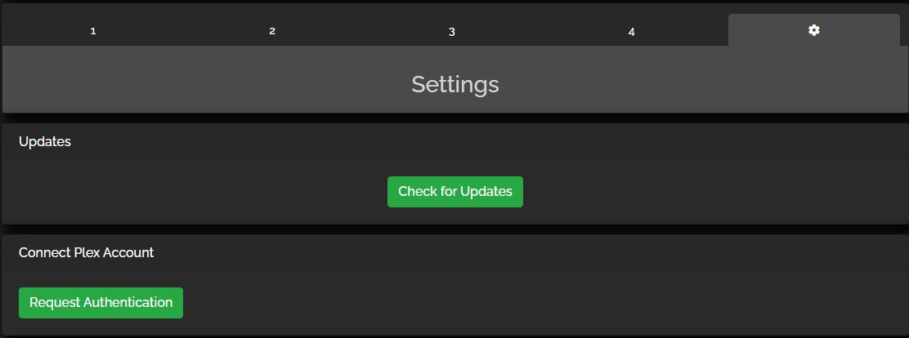
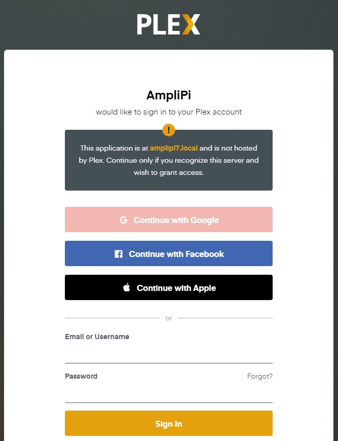
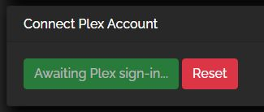
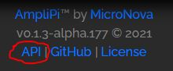
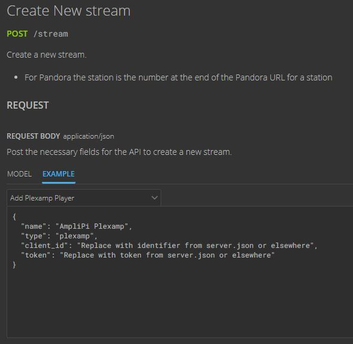

# Turning your AmpliPi into a Plexamp Player
This guide will detail multiple ways to setup Plexamp on the AmpliPi system.

## Prerequisites
Regardless of which setup path you take, a few requirements must be met. First, Plexamp must be installed on the Pi. ***This should come standard with our AmpliPi install.*** If you find yourself needing to install it, we use a modified copy of Plexamp v1.0.5 for the Pi. Download version 1.0.5 from this [link](https://files.plexapp.com/elan/plexamp-v1.0.5-pi.tar.gz), copy it over to AmpliPi, and extract it in '/home/pi' with
```
tar -xvzf plexamp-v1.0.5-pi.tar.gz
```
Once everything is extracted, navigate to '/home/pi/plexamp/server/' and find 'server.prod.js'. This file needs to be replaced with our modified version.
Our version can be found [here.](https://gist.github.com/micronova-jb/1156b1d04639284e5c6a354de4ec3002)

You will also need a Plex Pass subscription to be able to discover the device (Plexamp is a subscription-only service).

Finally, Node 9 is required since this is an older version of the Plexamp software. To get the proper version of Nodejs, follow the official install guide [here.](https://forums.plex.tv/t/plexamp-for-raspberry-pi-release-notes/368282)
To get the proper version, simply run
```
sudo apt-get install nodejs=9.11.2-1nodesource1
```

## Option 1 - Using the AmpliPi API
This is the simplest option available. Simply navigate to the Settings pane on 'amplipi.local/' and click the "Request Authentication" button under "Connect Plex Account"



Connecting your Plex account is as easy as clicking this button, then entering your username/password. Upon entering the information for an account with a Plex Pass subscription, a unique identifier/token pair will be generated for your AmpliPi.



This information will be used to create a Plexamp stream in a similar fashion to Pandora, Spotify, etc. named AmpliPi Plexamp! If you accidentally close the tab, or the authentication request runs out of time, you can always hit the Reset button and try again.



## Option 2 - Manual ID/Token creation
If you would like to do some development of your own, or want access to the token generation process for any other reason, this is the way to go. The steps below outline this process using a Linux terminal - check out our JavaScript if you'd like a web-based option!

### Step 1
To start, request a pin from Plex. This is most easily done on a Linux-based system, or by using SSH to connect to AmpliPi. To do this, put the following command into your terminal:
```
curl -X POST https://plex.tv/api/v2/pins \
-H 'accept: application/json' \
-d 'strong=true' \
-d 'X-Plex-Product=AmpliPi' \
-d 'X-Plex-Client-Identifier=<clientIdentifier>'
```
Where "\<clientIdentifier>" should be replaced with a unique string/number sequence. Using 'uuidgen' is pretty simple, and it provides a reasonably unique entry for clientIdentifier. Once you have replaced the text with your UUID, hit Enter.

The system should respond with a block of information that it fetched. The important information here is "id":##########, "code":"xxxxxxxxxxxxxxxxxxxxxxxxx", and our clientIdentifier/UUID from before.

### Step 2
Next, generate a URL from the information you received. A sample looks something like this:
```
https://app.plex.tv/auth#?clientID=<clientIdentifier>&code=<pinCode>&context%5Bdevice%5D%5Bproduct%5D=AmpliPi
```
Replace \<pinCode> and \<clientIdentifier> with the "code" and UUID from the previous steps. This should create a functional link that requests a Plex sign-in. Give your Plex Pass account information and feel free to close the window when prompted. This should have generated a Plexamp token.

### Step 3
Retrieve the token with another command line input:
```
curl -X GET 'https://plex.tv/api/v2/pins/<pinID>' \
-H 'accept: application/json' \
-d 'code=<pinCode>' \
-d 'X-Plex-Client-Identifier=<clientIdentifier>'
```
Using the information from Step 1, replace \<pinID> with your "id", \<pinCode> with "code", and \<clientIdentifier> with your UUID.

This request returns a similar block of information to that received in Step 1, though "authToken" should no longer be null. This is your new Plexamp token! It should be a 20-character string. Copy this over to 'server.json' along with your clientIdentifier - you should now have a working Plexamp device!
```
SERVER.JSON snippet:

"player": {
  "name": "AmpliPi-Template",    <--- Can be whatever you choose
  "identifier": "xxxxxxxx-xxxx-xxxx-xxxx-xxxxxxxxxxxx" <--- clientID
},
"user": {
  "token": "_" <--- authToken
},
```

## Option 3 - Getting a server.json file from an existing install
This option requires an install of an older version of the Plexamp desktop application on a different computer.

The install links can be found here:

for windows - https://plexamp.plex.tv/plexamp.plex.tv/Plexamp%20Setup%201.1.0.exe

for MacOS - https://plexamp.plex.tv/plexamp.plex.tv/Plexamp-1.1.0.dmg


Follow the steps to install Plexamp, then sign in with your account. This should generate a server.json with a working token/id pair. Navigate to the file on your system and open it with a text editor. You can find server.json here:

for windows - c:\Users\USER_\AppData\Local\Plexamp\server.json

for MacOS - /System/Volumes/Data/Users/USER_/Library/Application Support/Plexamp/server.json

Where USER_ is replaced with your username on that system. Once you've opened this file, create a Plexamp stream source using the WebApp's built in API!



Once you're on amplipi.local/api/doc, select 'Create New Stream' from the sidebar. Choose to use an example, and select "Add Plexamp Player" from the dropdown menu.



Replace the necessary fields (client_id and token) with the information from your existing server.json file, then hit "TRY" to create the stream. "FILL EXAMPLE" can be used to reset the view with the standard format, while "CLEAR" will empty the view.


