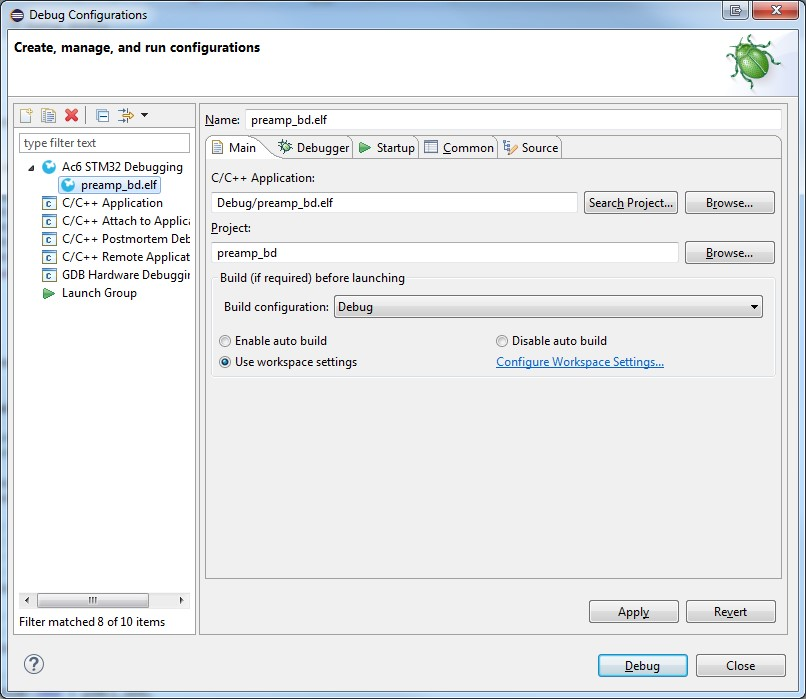
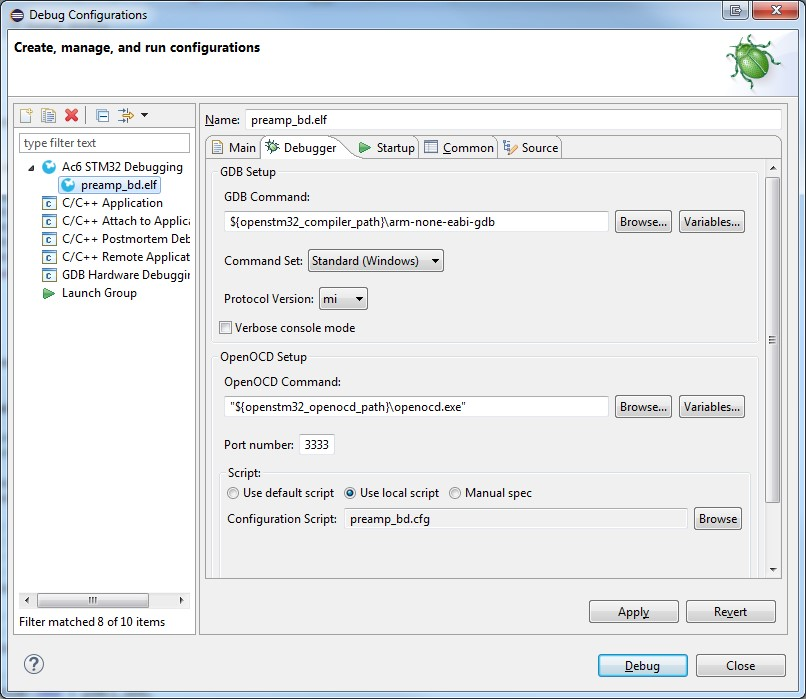
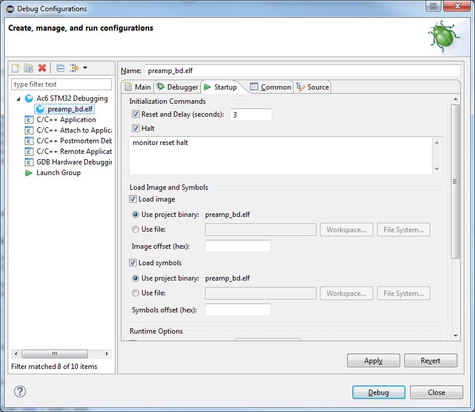
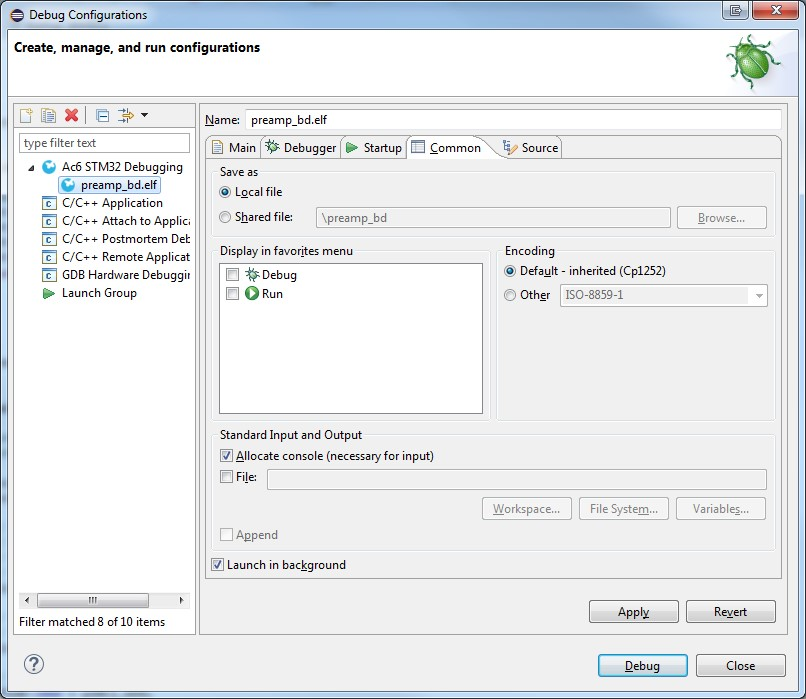

# Preamp Board Firmware Development for the AmpliPi Project
This guide will outline the procedure and required tools for Preamp firmware
development using the STM32 microcontroller.

The microcontroller on the Preamp Board is an STM32F030R8 ARM Cortex M0
from STMicroelectronics.
It is responsible for managing the audio mux, volumes, fan control,
front-panel LEDs, and more.
Binary releases of the firmware are shipped with AmpliPi software.
For anyone desiring to make changes, full development of the STM32's firmware
is possible either on a remote machine or on the AmpliPi's Raspberry Pi itself.

## Visual Studio Code
Just like the AmpliPi software, we typically use VS Code for firmware development.
However the build is CMake-based, so any IDE which integrates with CMake can
be used, or even no IDE at all!

Simply clone the AmpliPi repo and open the cloned directory in VS Code.
The `CMake Tools` and `C/C++` extensions will be recommended,
install those to get full support for intellisense and building.

### Linux Requirements
See the Preamp's [README](fw/preamp/README.md) for instructions.

### Windows Requirements
This section will be updated with a full local build guide,
but for now use the [Remote Editing and Programming](#remote-editing-and-programming) option.

### Developing Directly on the Pi
First setup the Pi for development as described in the Preamp's
[README](fw/preamp/README.md).
Then you can `ssh` to the Pi and edit using any terminal-based
text editor, or you can plug in a keyboard, mouse, and monitor to AmpliPi
and use a graphical text editor.
Unfortunately VS Code runs very slowly on the Pi and so is not recommended.

### Remote Editing and Programming
VS Code can be used as a remote IDE, so we can use the AmpliPi as a
headless development workstation and do the actual code editing on a
remote computer.
This option combines developing directly on the Pi with the benefits of
using all the features of VS Code.
See [vscode_remote_dev.md](vscode_remote_dev.md) for instructions on
setting up VS Code remotes.

## Debugging
Debugging is available through the SWD debugger header on the Preamp board (J8). We typically connect a Nucleo-F030R8 development board to this port and use it as an ST-LINK/V2-1 debugger/programmer. Be sure to line up pin 1 from the debugger with pin 1 on the Preamp board debug port, noting that the cable is six pins wide, while the port on the Preamp board is five pins wide - the sixth pin is not needed. Some helpful links can be found below:
The Nucleo board can be purchased/researched [here.](http://www.st.com/content/st_com/en/products/evaluation-tools/product-evaluation-tools/mcu-eval-tools/stm32-mcu-eval-tools/stm32-mcu-nucleo/nucleo-f030r8.html)
The STM32 ST-LINK Utility provides the ability to easily erase the flash and to reset the board when other software will not connect, among other things. Find it [here.](http://www.st.com/content/st_com/en/products/embedded-software/development-tool-software/stsw-link004.html)

## System Workbench IDE/Debugging
As an alternative System Workbench for STM32 can also be used as an IDE.
It is based on Eclipse, and can be found
[here.](http://www.openstm32.org/System+Workbench+for+STM32)

Once you are in System Workbench,
set the debug configuration according to the pictures below:






For the debugger to work properly, YOU MUST MODIFY stm32f0x.cfg.
With System Workbench installed, it should be found in
```
(root)/Ac6/SystemWorkbench/plugins/fr.ac6.mcu.debug_XXXX/resources/openocd/scripts/target/stm32f0x.cfg
```
where (root) is the directory you installed it in.
Once this file is open, find this line: adapter_khz 1000
And change it to: adapter_khz 480

Once all of these steps are complete, the debugger should be functional!
Within the IDE, it is possible to build and debug the project.
The build and debug options can be found in the toolbar at the top of the
debugger, and they each come with multiple options.
Build should work if the project was set up properly, even without a debugger.


