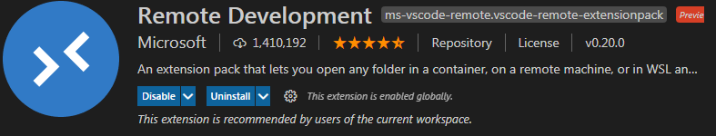
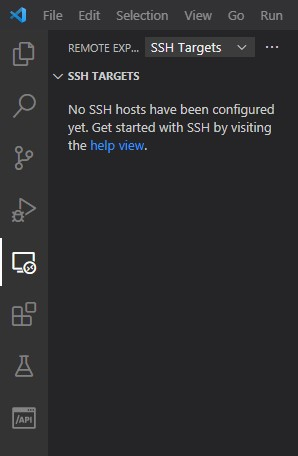
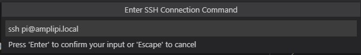
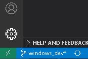
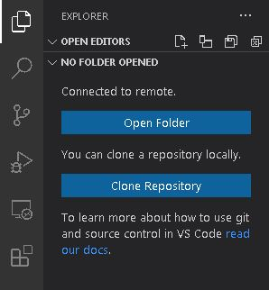
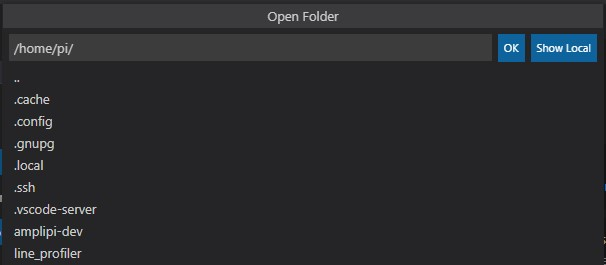
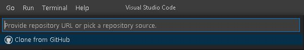
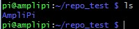
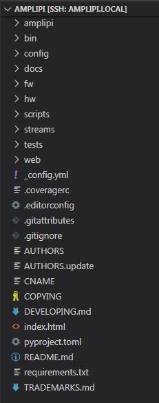

# Remote Development on the Pi With Visual Studio Code
This guide will detail the process of developing remotely on the Raspberry Pi using an extension in VS Code. For more information on this extension, follow this [link.](https://code.visualstudio.com/docs/remote/ssh)
For information on the Git extension, check out this [link.](https://code.visualstudio.com/docs/editor/versioncontrol)
### Follow the instructions below to install the extension and establish a connection with AmpliPi via SSH
1. Open VS Code and install the Remote Extension Pack under the extensions menu (Ctrl+Shift+X) – this should pop up as a recommended extension if our GitHub repository is the project you have open.

2. Once it installs, this extension should create a Remote Explorer pane on the VS Code sidebar – from here, you can select SSH Targets from the dropdown menu at the top. Your AmpliPi likely isn’t an option yet, so add it with the ‘+’ near the top right of the Remote Explorer pane that shows up when you hover the mouse over this pane or have it selected.

3. In the dialog that follows, enter "ssh pi@amplipi.local"

4. Once added, right-clicking on an SSH target will give you a choice of opening an SSH connection in the current window, or a new window. Select your preference.

5. As an alternative connection method, you can click on the green button at the bottom left of VS Code with the Remote Development icon on it.

6. From the list that now opens at the top of VS Code, choose “Remote-SSH: Connect to Host…” or whatever your connection preference is. You can type pi@amplipi.local, or select the existing amplipi.local if you went through the previous effort of adding it as an SSH connection.

7. Once the new window/tab opens, VS Code will take some time to initialize the new environment. After the initialization, you can go to the file explorer on the left side bar (or hit Ctrl+Shift+E).

8. The Open Folder option allows you to open an existing directory on the AmpliPi.

9. If you have a Git installation on your PC, VS Code should have some extra features. In this case, the file explorer opened in Step 7 should also show a Clone Repository option. Clicking on this provides more options at the top of the window:

The Clone from GitHub option requires a GitHub sign-in so that you can choose a repository that you're working on. Alternatively, you can provide a direct link to the AmpliPi repository (https://github.com/micro-nova/AmpliPi). After this choice, VS Code asks for an existing directory on the AmpliPi to clone the repository to.

10. This clones the repository into your selected folder using VS Code’s Git Extension. Upon finalizing the cloning process, VS Code will ask if you want to open the new repository. Opening it will allow you to remotely develop on your AmpliPi!

